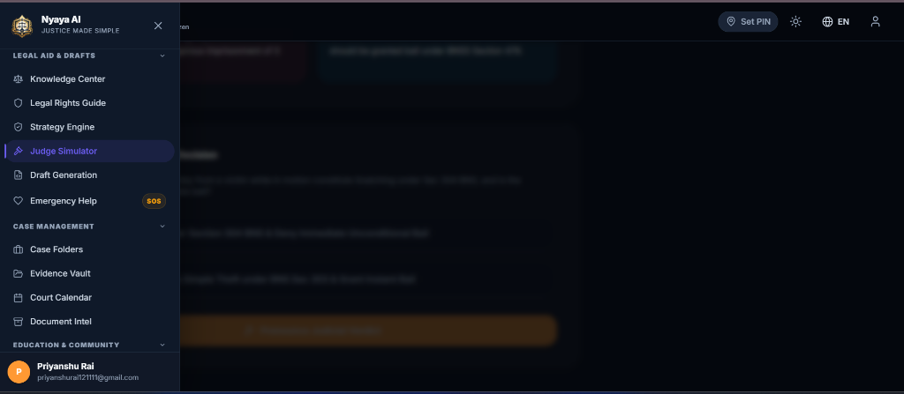
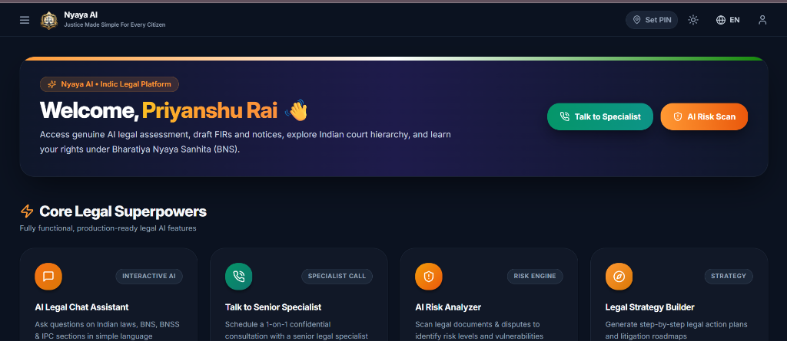
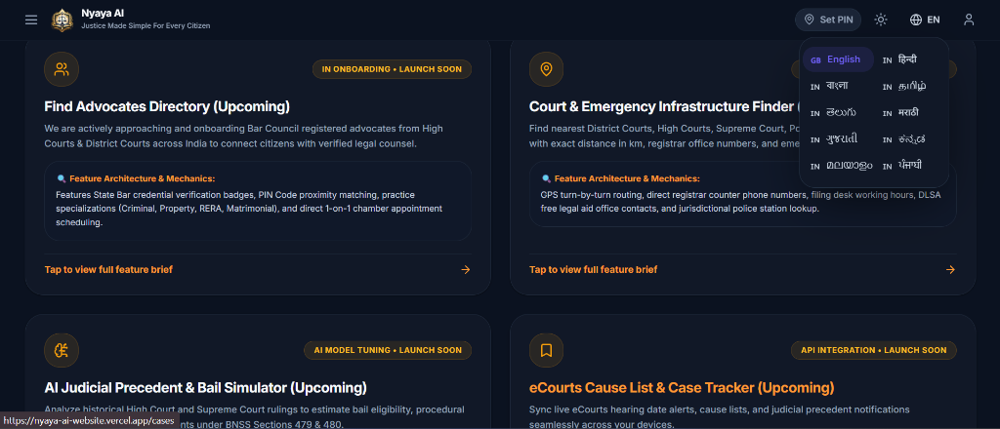
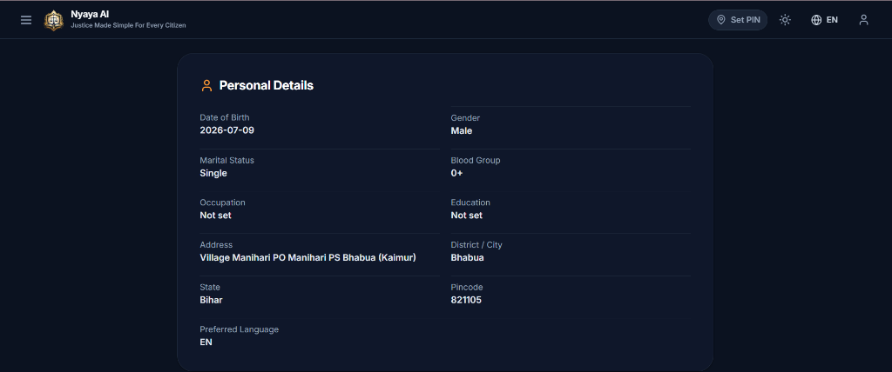
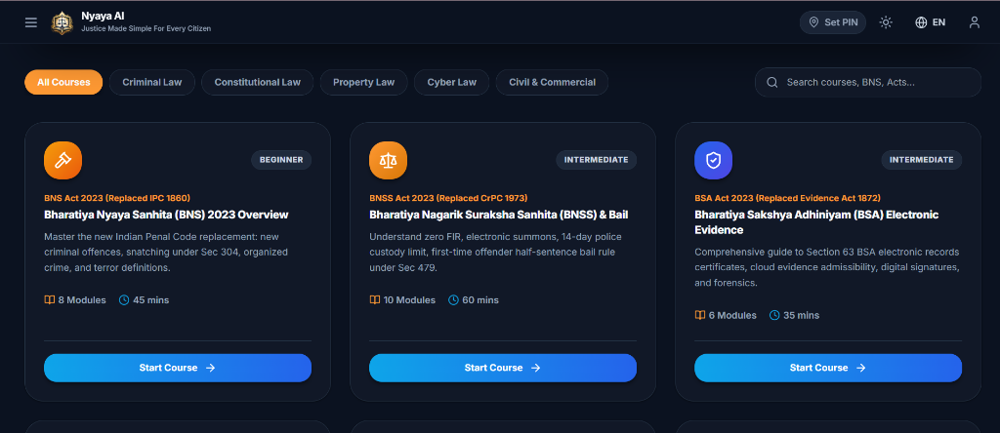
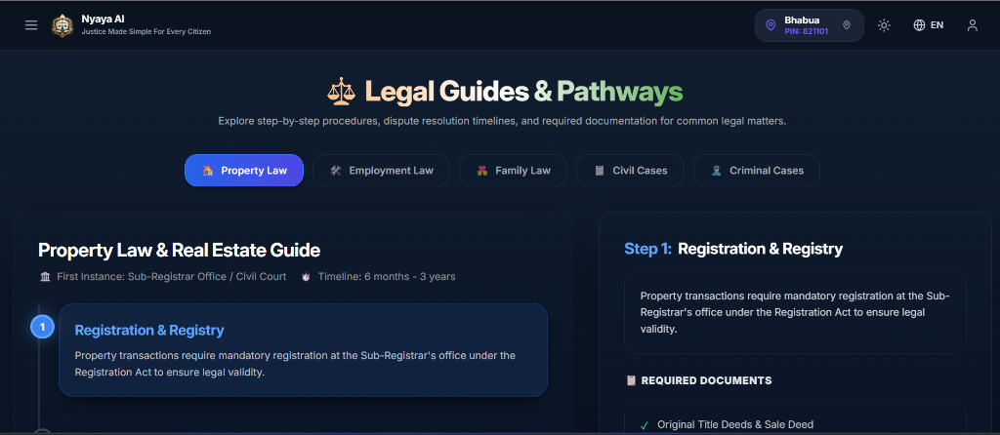
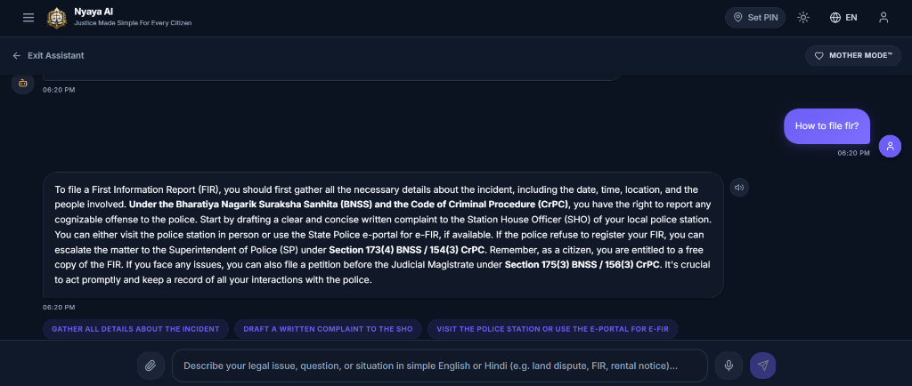
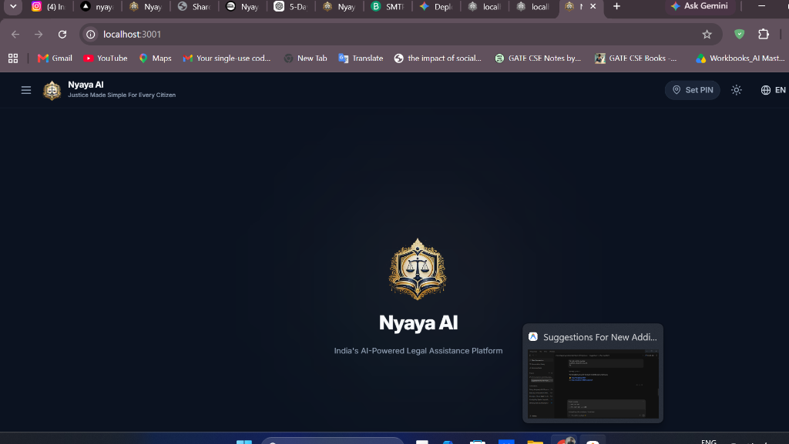

# ⚖️ Nyaya AI (न्याय AI)

> India's Multilingual AI Legal Assistant

Nyaya AI is an AI-powered legal assistance platform that helps users understand legal information, analyze legal documents, connect with advocates, and access legal guidance in simple language. The platform is designed to make legal services more accessible through artificial intelligence, multilingual support, and an intuitive user experience.

🌐 **Live Website:** [https://nyaya-ai-website.vercel.app/](https://nyaya-ai-website.vercel.app/)

---

# 📖 Overview

Understanding legal documents and procedures can be difficult for many people because of complex legal terminology and lengthy documentation. Nyaya AI simplifies this process by providing AI-powered legal assistance in multiple Indian languages.

Users can chat with an AI legal assistant, upload legal documents for analysis, discover advocates, manage consultations, and organize their legal information from a single platform.

The platform is built with a modern full-stack architecture using Next.js, FastAPI, PostgreSQL, and Groq-powered Large Language Models (LLMs).

---

# ✨ Features

## 🤖 AI Legal Assistant

- AI-powered legal conversations
- Context-aware responses
- Follow-up conversations
- Structured legal explanations
- Real-time AI responses

---

## 📄 Legal Document Analysis

Upload and analyze documents such as:

- Contracts
- Agreements
- FIRs
- Legal Notices
- Court Orders
- Property Documents
- Government Documents

The AI helps users by:

- Summarizing documents
- Explaining legal terminology
- Highlighting important sections
- Answering document-related questions

---

## 🌐 Multilingual Support

Supports multiple Indian languages including:

- English
- Hindi (हिन्दी)
- Bengali (বাংলা)
- Tamil (தமிழ்)
- Telugu (తెలుగు)
- Marathi (मराठी)
- Gujarati (ગુજરાતી)
- Kannada (ಕನ್ನಡ)
- Malayalam (മലയാളം)
- Punjabi (ਪੰਜਾਬੀ)

Users can change their preferred language at any time, and the application interface updates accordingly.

---

## 👨‍⚖️ Advocate Discovery

- Search advocates
- Filter by specialization
- View advocate profiles
- Book consultations
- Contact advocates

---

## 📅 Consultation Management

- Schedule appointments
- View consultation history
- Track booking status

---

## 👤 User Management

- User Registration
- Secure Login
- JWT Authentication
- Profile Management
- Language Preferences
- Account Settings

---

## 📂 Document Management

- Upload Documents
- Secure Storage
- View Uploaded Files
- Document History

---

## 🎨 Modern User Experience

- Responsive Design
- Mobile Friendly
- Dark Mode
- Light Mode
- Clean Dashboard
- Professional UI

---

# 🛠️ Technology Stack

## Frontend

- Next.js
- React
- TypeScript
- Tailwind CSS
- Framer Motion

## Backend

- FastAPI
- Python
- SQLAlchemy

## Database

- PostgreSQL (Supabase)

## Authentication

- JWT Authentication
- Password Hashing

## AI

- Groq API
- Large Language Models (LLMs)

## Email Service

- Brevo SMTP

## Deployment

- Vercel
- Railway
- Supabase

---

# 📂 Project Structure

```text
Nyaya-AI/
│
├── src/
│   ├── app/
│   ├── components/
│   ├── context/
│   ├── hooks/
│   ├── locales/
│   ├── services/
│   └── lib/
│
├── backend/
│   ├── app/
│   │   ├── api/
│   │   ├── core/
│   │   ├── database/
│   │   ├── middleware/
│   │   ├── models/
│   │   ├── routers/
│   │   ├── schemas/
│   │   ├── services/
│   │   └── utils/
│   │
│   └── requirements.txt
│
├── docs/
│   └── screenshots/
│
├── README.md
└── LICENSE
```

---

# 🔄 Application Workflow

```text
User

↓

Register / Login

↓

Dashboard

↓

Choose a Service

↓

AI Legal Chat
OR
Upload Legal Document
OR
Book Consultation

↓

AI Analysis

↓

Legal Information & Guidance

↓

Save History
```

---

# 🔒 Security

Nyaya AI follows modern security practices:

- JWT Authentication
- Password Hashing
- Secure REST APIs
- Input Validation
- Environment Variable Protection
- Database Security
- Protected Routes

---

# 📸 Screenshots & Feature Demonstration

### 1. 🤖 AI Legal Chat Assistant ("Mother Mode™" & Legal Statutory Guidance)

*The AI Legal Assistant provides real-time, context-aware responses citing specific Indian statutory laws (such as BNSS Section 173(4) and CrPC Section 154(3)). Features include Mother Mode™ for simplified explanations, voice input, and step-by-step action recommendation chips.*

---

### 2. 🏠 Personalized Citizen Dashboard & Welcome Banner

*Centralized citizen portal welcoming authenticated users by name ("Welcome, Priyanshu Rai 👋") with quick actions (Talk to Specialist, AI Risk Scan) and Core Legal Superpowers (AI Chat, Specialist Call, Risk Analyzer, Strategy Builder).*

---

### 3. 🌐 Built-in 10-Language Indian Multilingual System

*Built-in multi-language translation engine supporting 10 major Indian languages (English, Hindi, Bengali, Tamil, Telugu, Marathi, Gujarati, Kannada, Malayalam, and Punjabi). Users can toggle languages instantly without page reloads.*

---

### 4. 👤 Authenticated User Profile & Permanent Details Storage

*Connected user profile permanently storing personal information in PostgreSQL (Date of Birth, Gender, Marital Status, Blood Group, Occupation, Education, Address, District, State, Pincode, and Preferred Language).*

---

### 5. 🎓 Legal Learning Academy (BNS, BNSS & BSA 2023 Modules)

*Interactive learning academy offering 14 structured modules covering new Indian criminal laws (Bharatiya Nyaya Sanhita 2023, Bharatiya Nagarik Suraksha Sanhita 2023, Bharatiya Sakshya Adhiniyam 2023 Electronic Evidence), Consumer Protection, and POSH Act with quizzes.*

---

### 6. 🗺️ Nyaya Path - Legal Guides & Action Pathways

*Step-by-step procedure navigator showing dispute resolution timelines, required documents, first-instance authorities, and jurisdictional guidance for Property Law, Employment Law, Family Law, Civil, and Criminal Cases.*

---

### 7. 🛠️ Citizen Legal Tools & Feature Hub

*Quick-access cards for FIR & Legal Notice Generator, AI Evidence Vault (OCR), Legal Learning Academy, and Nyaya Path Court Hierarchy Navigator.*

---

### 🗂️ 8. Full Navigation Console Drawer

*Comprehensive navigation drawer organizing legal tools into Core Console, Legal Aid & Drafts, Case Management, and Education & Community modules.*

---

# 🌟 Future Enhancements

- Voice-Based Legal Assistant
- OCR for Scanned Documents
- AI Legal Research
- Court Case Tracking
- Video Consultation
- Mobile Application
- E-Sign Documents
- Smart Legal Search
- Legal Calendar
- Push Notifications

---

# ⚠️ Disclaimer

Nyaya AI is an AI-powered legal information platform created to help users understand legal concepts and documents more easily.

The information provided by the application is intended for educational and informational purposes only. It should not be considered legal advice or a substitute for consultation with a qualified legal professional.

Users should consult a licensed advocate before making legal decisions or taking legal action.

---

# 🤝 Contributing

Contributions are welcome.

If you'd like to improve Nyaya AI:

1. Fork the repository
2. Create a new branch
3. Commit your changes
4. Push the branch
5. Open a Pull Request

---

# 📜 License

This project is licensed under the MIT License.

---

# 👨‍💻 Developer

**Priyanshu Rai**

B.Tech in Computer Science & Engineering

GitHub: [https://github.com/priyanshurai10](https://github.com/priyanshurai10)

LinkedIn: [https://linkedin.com/in/priyanshu-rai-2114722ab](https://linkedin.com/in/priyanshu-rai-2114722ab)

---

## ⭐ Support

If you like this project, please consider giving it a ⭐ on GitHub.
It helps others discover the project and supports future development.

---

© 2026 Nyaya AI. All Rights Reserved.
